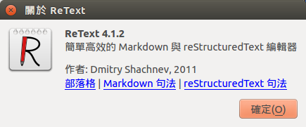

# Git 版本控制系統世界哈囉！<br >Hello Git world!
## 智慧財產授權條款
創用ＣＣ BY 3.0 或其任意更新版本

## 第一章 - 版本控制？那是什麼？可以吃嗎？
本章節企圖給您版本控制系統的一些基本概念，為後面的章節進行準備。

### 內容<br>Content
顧名思義，內容就是您的某個工作的內容（如果是軟體開發的話就是軟體的來源程式碼(source code)，如果是寫一本書的話就是書的內容）。

### 版本<br>Version/Revision
版本(version/revision)為您對內容(content)的特定狀態所取名的識別名稱，如：  


「4.1.2」為 Retext 這個 Markdown 與 reStructuredText 編輯器對於該軟體目前的狀態（程式設計、介面設計等）的識別名稱。版本不一定一定要如前例一樣是數字跟英式句點(period)的組合，您如果高興的話也可以把某個內容的特定狀態取名為「黃色小鴨」版或是「逆轟高灰」版。

### 內容變更／差異<br>Content Changes/Diff(erence)
然而對我們來說版本叫作什麼並沒有多大的意義，我們反倒通常對「兩個不同的版本之間內容到底變了什麼」比較感興趣，這就是「內容變更／內容差異」，比方說：

* （相對於 0.1 版本，）Retext 0.2 版本修正了某些情況下啟動會發生程式崩潰的問題。
* 這本書的第二版新增了「作者的話」章節，由於這個章節對我來說沒什麼用所以我只要買第一版就好了。

### 版本控制<br>Version Controlling
顧名思義，企圖控制好你的內容的各個不同的版本（跟他們的的內容變更），讓您在某些問題中可以得到方便就是版本控制，比方說：

* 這個程式在第 0.2 版本的時候被我改到爛掉了，但是我還有第 0.1 版本的內容備份，此時我至少可以做兩件事解決這個問題：
	1. 把第 0.2 版本跟第 0.1 版本拿出來比較(compare)一下看看我改了什麼，找到問題之後再把 0.2 版修好。
    2. 打掉重練，把第 0.2 版直接捨棄，換回第 0.1 版重新出發。

這樣通常總比「由於 0.1 版弄不回來了，只能一直看 0.2 版想辦法把錯誤揪出來」有彈性多了，這就是版本控制的其中一種好處。

### 版本控制系統<br>VCS

### Git 版本控制系統<br>Git VCS

#### 版本倉庫<br>(Version/Revision) repository
顧名思義，版本倉庫就是保存所有版本（實際上是保存各個版本之間的內容變更）的場所。

## 第二章 - Git 初次見面！
### Git 命令<br>Git commands
Git 版本控制系統由多個大部份都在命令列介面底下執行的「Git 命令」組成，執行 Git 命令的方式為：
```
$ git 〈Git 命令名稱〉
```
例： `$ git help`  
或是
```
$ git-〈Git 命令名稱〉
```
例： `$ git-help`  

這兩種下命令的方式的效果都是相同的，本文中的內容將會使用 `$ git 〈Git 命令名稱〉` 的格式。

### 使用 Git 版本控制系統時如何尋求幫助？
#### 透過 `help` Git 命令 
若不知道某 Git 命令要怎麼用（命令可接受的下命令格式，有哪些命令選項(options)可以改變它的行為等），我們可以使用 `git help 〈Git 命令名稱〉` 命令來察看該 Git 命令的 manpage 使用手冊頁面（manpage 為 manual page 的縮寫）。

#### 察看 Pro Git
[Pro Git](http://git-scm.com/book/zh-tw) 是由 Scott Chacon 和 Ben Straub 所著的 Git 官方教科書。

#### 於 irc.freenode.net IRC 聊天室托管服務的 #git 頻道討論
安裝一個 IRC 聊天室客戶端，連上 irc.freenode.net 站台再加入 #git 頻道即可參與 Git 相關的線上討論。

### 編輯 Git 使用者帳號範圍的設定檔(git config)
Git 有非常多種設定值可以改變它的行為，使用 `config` Git 命令可以編輯您的 Git 設定值，編輯使用者帳號範圍命令格式如下：
```
$ git config --global 〈設定值名稱〉 〈設定值內容（如果設定值內容包含「英式空白字元」的話整個參數要用引號括住才不會被殼程式錯誤地解釋為兩個分開的參數，詳細資訊請參考您使用的殼程式的使用手冊）〉
```

底下我們先設定一些必要的東西。
 
#### 設定你的稱謂與電子郵件地址（此設定值設定好後才能提交新版本）
於 Git 版本控制系統中每個版本都跟建立該版本的人的「身份」連結在一起，「身份」包含該人的稱謂（建議但不一定要是您的真名）跟電子郵件地址。

於 Git 中通常身份會以 RFCXXX 規範的格式顯示，比方說
```
Ｖ字龍(Vdragon Taiwan) <Vdragon.Taiwan@gmail.com>
```

使用下列命令設定您的稱謂跟電子郵件地址
```
$ git config --global user.name 〈您在 Git 中要使用的稱謂（如果內容包含空白字元的話整個參數要用引號括住才不會被殼程式錯誤地解釋為兩個分開的參數）〉
$ git config --global user.email 〈您的電子郵件地址〉
```

比方說要設定前面
```
Ｖ字龍(Vdragon Taiwan) <Vdragon.Taiwan@gmail.com>
```
的身份的話就執行
```
$ git config --global user.name "Ｖ字龍(Vdragon Taiwan)"
$ git config --global user.email Vdragon.Taiwan@gmail.com
```

### 初始化 Git 版本倉庫(git init)

### 將內容變更移入版本提交準備區域(staging area)(git add)

#### 僅將檔案部份內容變更移入版本提交準備區域(git add --patch)

### 將版本提交準備區域內的內容變更提交至版本倉庫中為一個新的版本(git commit)

#### 為版本提交簽名

## 第三章 - Git 再次見面！
### 察看 Git 命令的使用手冊(git help)

### 編輯 Git 使用者範圍的設定檔(git config)
Git 有非常多種設定值可以改變它的行為。Git 設定分為系統全域設定、使用者範圍設定跟版本倉庫範圍設定三種，於類 Unix 作業系統中系統全域設定檔位於 `/etc/gitconfig`，使用者範圍設定檔位於使用者帳號家目錄(home directory)底下的 `.gitconfig` 檔案（注意在類 Unix 作業系統中以英式句點(.)作為開頭的檔案系統項目預設是隱藏的），版本倉庫範圍設定位於版本倉庫目錄(.git/)底下的 config 檔案
 
### 察看 Git 版本倉庫版本提交紀錄(commit log)(git log)

### 將檔案從版本追蹤中移除(git rm)

#### Git 版本追蹤忽略規則(.gitignore)

#### 將內容變更自版本提交準備區域移出(git rm --cached)

### 建立新的分支(git branch)

### 新增遠端版本倉庫(git remote add)

### 


## 其他資源<br>Other resources
這邊列舉一些其他的「Git 版本控制系統」的學習資源

* [Pro Git](http://git-scm.com/book/zh-tw/)
	* **官方** Git 介紹書籍（有中文翻譯版本）
* [Code School - Try Git](https://try.github.io/)
	* 闖關式的 Git 教學（英文）（推荐）
* [寫程式？那些老師沒教的事(P.1~99)](https://drive.google.com/open?id=0B3e9XCL1ZWE8US03SnlRRGdQak0&authuser=0)
	* 由 CrBoy 所做的演講投影片（中文），前面的介紹很精彩可以看看

## 未整理內容
### 提交（動詞）<br>Commit(verb)
將你的內容差異(diff)（字面意義上）提交到版本控制系統成為「一個新的版本」的動作我們稱為「提交(commit)」

### 版本提交（名詞）<br>(Version) commit(noun)
前面提到的「一個新的版本」本身一樣我們也可以稱做「一個版本提交(commit)」

### 版本倉庫<br/>(Version) Repository
顧名思義

## 版本控制系統<br>Version Control System
